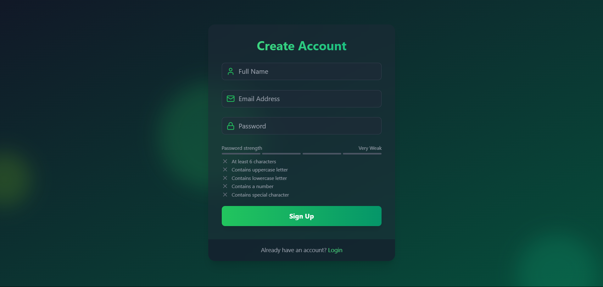
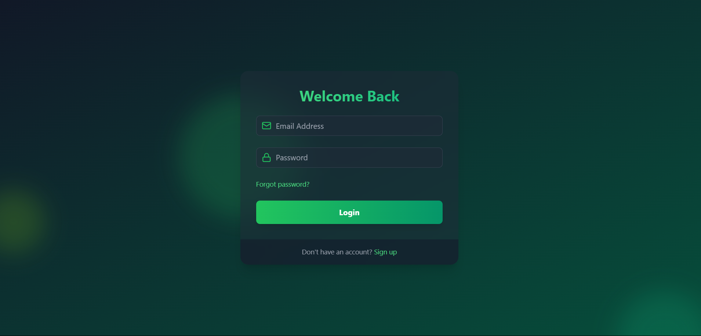
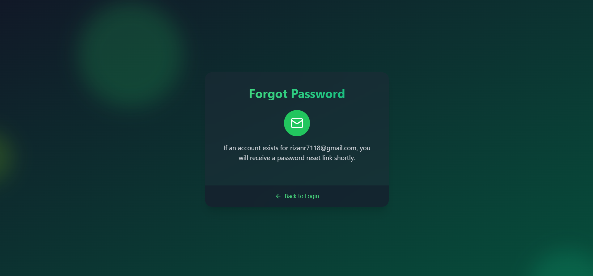
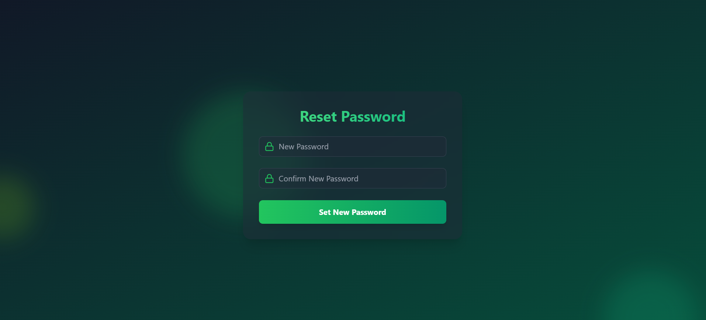
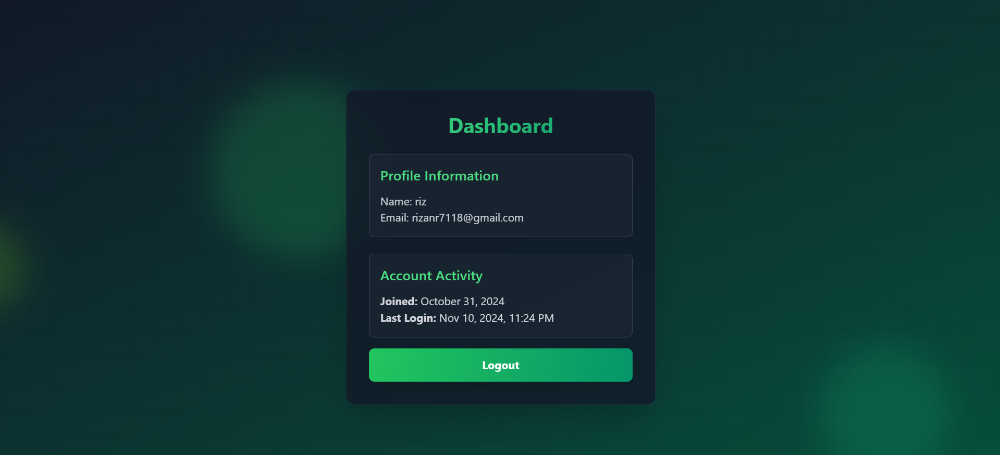

MERN User Authentication Web Application

This project is a User Authentication Web Application built with the MERN stack (MongoDB, Express, React, Node.js) that allows users to sign up, log in, verify their OTP, reset their password, and access a dashboard once authenticated. Welcome and reset password emails are sent using Mailtrap for testing purposes.

Features

Sign Up: Users can create a new account with their email and password.

Email Verification: After sign-up, an OTP is sent to the user's email for verification.

Welcome Email: Sends a welcome email upon successful sign-up.

Login: Users can log into their account with valid credentials.

Forgot Password: Allows users to request a password reset if they forget their password.

Reset Password: Users can reset their password via a link sent to their email.

Dashboard: Accessible only to logged-in users, displaying user-specific information.

Tech Stack

Frontend: React
Backend: Node.js, Express
Database: MongoDB
Email Service: Mailtrap (for development/testing purposes)

Installation and Setup
Clone the repository:

bash
Copy code
git clone https://github.com/your-username/your-repo-name.git
cd your-repo-name
Install dependencies for both frontend and backend:

bash
Copy code
cd frontend
npm install
cd ../backend
npm install
Configure Environment Variables:

In the backend folder, create a .env file.
Add the following variables:
makefile
Copy code
MONGO_URI=your_mongodb_connection_string
JWT_SECRET=your_jwt_secret
MAILTRAP_USER=your_mailtrap_username
MAILTRAP_PASS=your_mailtrap_password
Start the Application:

In the backend folder, start the server:
bash
Copy code
npm start
In the frontend folder, start the React application:
bash
Copy code
npm start
Access the Application:

The application should be running at http://localhost:5173 (frontend).
The backend server is running at http://localhost:5000.